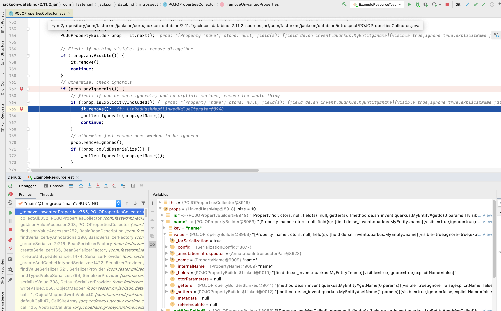

# json-broken-on-public-panache-fields project

## error description

This project demonstrates an error in json serialization
during unit testing with Quarkus in the following setup:

* @QuarkusTest is booting the framework
* extensions
    - quarkus-resteasy-jackson
    - quarkus-hibernate-orm-panache 
* io.restassured

###Observation:

- the public field ``name`` on entity ``MyEntity`` ist not getting send to the service from the QuarkusTest 

### found workaround

Either of these make the getting field serialized:

1. Annotate the field with ``@JsonProperty``.
2. Make the field private or package-private. 

### Lombok ? No

First assumption that this error might be related to my use of Lombok could not hold.

### Possible situation found during debugging on jackson

The property ``name`` is getting removed here:


# Quarkus
This project uses Quarkus, the Supersonic Subatomic Java Framework.

If you want to learn more about Quarkus, please visit its website: https://quarkus.io/ .

## Running the application in dev mode

You can run your application in dev mode that enables live coding using:
```
./mvnw quarkus:dev
```

## Packaging and running the application

The application can be packaged using `./mvnw package`.
It produces the `json-broken-on-public-panache-fields-1.0-SNAPSHOT-runner.jar` file in the `/target` directory.
Be aware that it’s not an _über-jar_ as the dependencies are copied into the `target/lib` directory.

The application is now runnable using `java -jar target/json-broken-on-public-panache-fields-1.0-SNAPSHOT-runner.jar`.

## Creating a native executable

You can create a native executable using: `./mvnw package -Pnative`.

Or, if you don't have GraalVM installed, you can run the native executable build in a container using: `./mvnw package -Pnative -Dquarkus.native.container-build=true`.

You can then execute your native executable with: `./target/json-broken-on-public-panache-fields-1.0-SNAPSHOT-runner`

If you want to learn more about building native executables, please consult https://quarkus.io/guides/building-native-image.